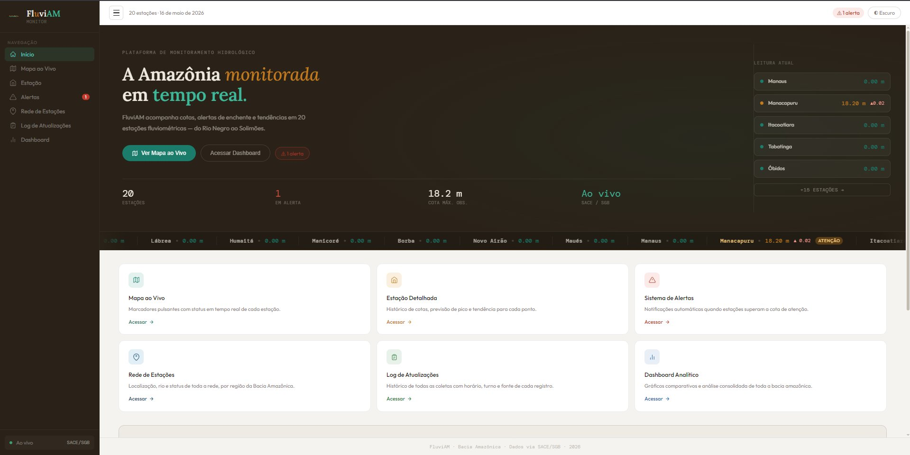
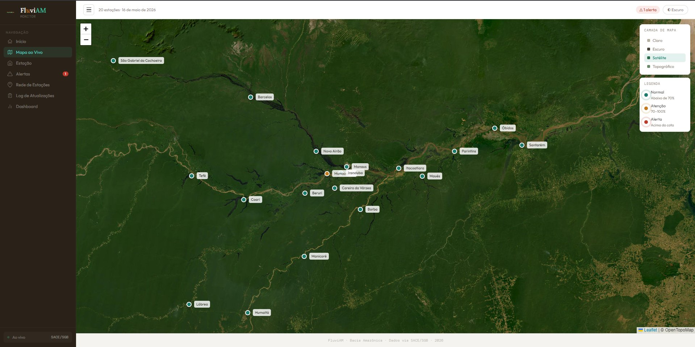
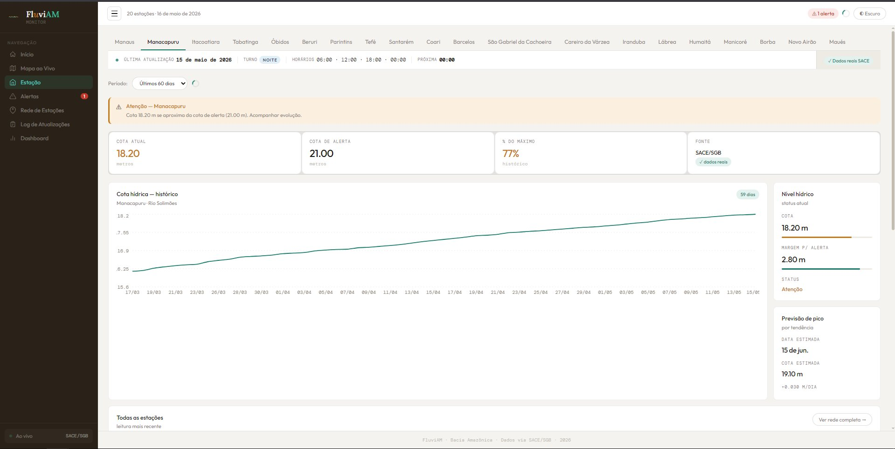
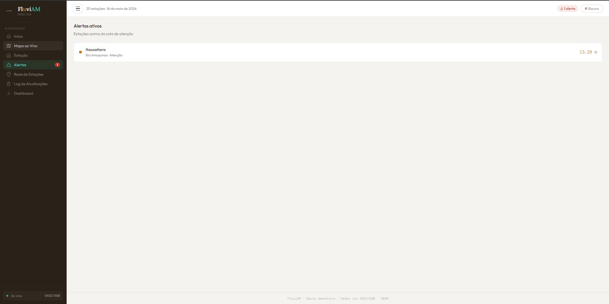

# 🌊 FluviAM — Dashboard de Monitoramento Fluviométrico da Bacia Amazônica

<p align="center">
  
  
  
  
  
  
</p>

<p align="center">
  <b>Plataforma web de monitoramento em tempo real de cotas e vazões do Rio Amazonas e tributários.</b><br/>
  Dados reais coletados das APIs do SACE/SGB e ANA, com fallback inteligente para Open-Meteo.
</p>

---

## 📋 Índice

- [Descrição](#-descrição)
- [Demo / Screenshots](#-demo--screenshots)
- [Stack Utilizada](#-stack-utilizada)
- [Funcionalidades](#-funcionalidades)
- [Arquitetura do Sistema](#️-arquitetura-do-sistema)
- [Estrutura de Pastas](#-estrutura-de-pastas)
- [Pré-requisitos](#-pré-requisitos)
- [Quick Start](#-quick-start)
- [Instalação](#-instalação)
- [Variáveis de Ambiente](#-variáveis-de-ambiente)
- [Como Executar](#-como-executar)
- [Scripts Disponíveis](#-scripts-disponíveis)
- [Endpoints da API](#-endpoints-da-api)
- [Fluxo da Aplicação](#-fluxo-da-aplicação)
- [Estações Monitoradas](#-estações-monitoradas)
- [Integrações Externas](#-integrações-externas)
- [Banco de Dados](#-banco-de-dados)
- [Testes](#-testes)
- [Deploy](#-deploy)
- [Docker / docker-compose](#-docker--docker-compose)
- [CI/CD](#-cicd)
- [Segurança e Boas Práticas](#-segurança-e-boas-práticas)
- [Melhorias Futuras](#-melhorias-futuras)
- [Troubleshooting](#-troubleshooting)
- [Contribuição](#-contribuição)
- [Licença](#-licença)

---

## 📖 Descrição

O **FluviAM** é uma plataforma fullstack de monitoramento hidrológico que agrega dados de cotas e vazões de **20 estações fluviométricas** distribuídas pela Bacia Amazônica. O sistema apresenta essas informações em um dashboard interativo com múltiplas visualizações, alertas de cheias e tendências mensais.

**Por que este projeto existe?** O Rio Amazonas e seus tributários afetam diretamente milhões de pessoas no Estado do Amazonas. Enchentes e secas extremas impactam transporte, abastecimento e habitação. O FluviAM centraliza dados dispersos em fontes governamentais e os entrega de forma clara e acessível.

**Público-alvo:** Pesquisadores, defesa civil, gestores públicos e cidadãos interessados no monitoramento hídrico amazônico.

---

## 🖼️ Demo / Screenshots

### Tela Inicial — Visão Geral da Plataforma

> Painel de entrada com status consolidado de todas as 20 estações, ticker de cotas em tempo real e atalhos para cada módulo da plataforma.

### Mapa ao Vivo — Bacia Amazônica

> Mapa interativo (Leaflet) com marcadores coloridos por nível de alerta, troca de camada cartográfica (Claro, Escuro, Satélite, Topográfico) e legenda integrada.

### Detalhe de Estação — Série Histórica e Previsão de Pico

> Detalhe da estação Manacapuru (Rio Solimões): 60 dias de cota hídrica, cota atual de 18,20 m, margem de 2,80 m para o alerta, status de **Atenção** e previsão de pico estimada em 15 de junho com cota de 19,10 m.

### Alertas Ativos

> Painel de alertas listando estações acima da cota de atenção. Itacoatiara (Rio Amazonas) aparece em estado de **Atenção** com cota de 13,29 m.

---

## 🛠️ Stack Utilizada

### Backend

| Tecnologia | Versão | Uso |
|-----------|--------|-----|
| Python | ≥ 3.11 | Linguagem principal |
| FastAPI | ≥ 0.104 | Framework da API REST |
| Uvicorn | ≥ 0.24 | Servidor ASGI |
| Pandas | ≥ 2.0 | Processamento e agregação de séries temporais |
| Requests | ≥ 2.31 | Consumo das APIs externas (SACE, ANA, Open-Meteo) |
| python-dotenv | — | Carregamento de variáveis de ambiente (instalar separadamente — ver [Instalação](#-instalação)) |

### Frontend — React (Interface Completa)

| Tecnologia | Versão | Uso |
|-----------|--------|-----|
| React | 18.2 | Framework de UI |
| Vite | 4.4 | Bundler e servidor de desenvolvimento |
| Axios | 1.6 | Requisições HTTP para a API |
| Recharts | 2.8 | Gráficos de linha, área e barra |
| Leaflet | 1.9.4 | Mapa interativo (carregado via CDN em runtime) |

### Frontend — HTML Estático (Opção Simplificada)

| Tecnologia | Versão | Uso |
|-----------|--------|-----|
| HTML / CSS / JS | — | Interface sem dependências de build |
| Chart.js | CDN | Gráficos de cota e vazão |

### Fontes de Dados Externas

| Fonte | Tipo | Dados |
|-------|------|-------|
| SACE/SGB | CSV via HTTP | Cotas reais a cada 15 minutos |
| ANA HidroWebService | REST autenticada (Bearer) | Cotas adotadas diárias (até 30 dias) |
| Open-Meteo Flood API | REST aberta | Vazão modelada (fallback) |
| `fallback.json` local | JSON em disco | Último snapshot salvo automaticamente |

---

## ✨ Funcionalidades

### Tela Inicial (Home)
- **Resumo executivo** com contagem de estações, quantidade em alerta e cota máxima observada
- **Ticker rolante** com cota atual e badge de nível de alerta de cada estação
- **Atalhos** para todos os módulos: Mapa, Estação, Alertas, Rede, Log, Dashboard
- Indicador de status de conexão com a fonte de dados (SACE/SGB)

### Mapa ao Vivo
- Mapa interativo **Leaflet** centrado na Bacia Amazônica
- **Marcadores pulsantes** coloridos conforme nível de alerta (verde / âmbar / vermelho)
- Troca de camada: Claro, Escuro, **Satélite**, Topográfico
- Popup com cota atual e fonte de dados ao clicar em cada estação
- Legenda integrada de status

### Detalhe de Estação
- Seleção por abas (todas as 20 estações visíveis horizontalmente)
- **Série temporal de cota** com seletor de período: 7 / 15 / 30 / 60 dias
- Gráfico de linha (Recharts) com data da última leitura e turno de coleta
- Cards com **cota atual**, **cota de alerta**, **% do máximo histórico** e **fonte dos dados**
- Painel lateral: nível hídrico, margem para alerta, status e **previsão de pico** (data e cota estimadas por tendência linear)
- Banner contextual de atenção quando a cota de atenção é ultrapassada

### Sistema de Alertas
- Lista todas as estações **acima da cota de atenção**, em tempo real
- Exibe rio, nível e cota atual de cada entrada
- Badge numérico na sidebar indica a quantidade de estações em alerta

### Rede de Estações
- Listagem completa das 20 estações com filtro por região e ordenação
- Exibe rio, código ANA e status atual de cada ponto

### Log de Atualizações
- Histórico de coletas com horário, turno e fonte de cada registro
- Filtro por fonte (SACE, ANA, Open-Meteo, Fallback)
- Contador de registros em cache local

### Dashboard Analítico
- Gráficos comparativos consolidados de toda a bacia
- Análise de tendência mensal histórica por estação

### Funcionalidades Transversais
- **Tema claro/escuro** com persistência em `localStorage`
- **Sidebar recolhível** para maximizar a área de visualização
- **Fallback automático em cascata**: SACE → ANA → Open-Meteo → JSON local
- **Interface responsiva** para desktop e dispositivos móveis
- **Splash screen** animada no carregamento inicial

---

## 🏗️ Arquitetura do Sistema

```
┌─────────────────────────────────────────────────────────────────────┐
│                        FONTES DE DADOS                              │
│  ┌─────────────┐  ┌─────────────────┐  ┌──────────────────────┐   │
│  │  SACE/SGB   │  │ ANA HidroWebSvc │  │  Open-Meteo Flood    │   │
│  │ (primário)  │  │  (secundário)   │  │     (terciário)      │   │
│  │  CSV a 15'  │  │  REST + OAuth   │  │  Vazão modelada      │   │
│  └──────┬──────┘  └────────┬────────┘  └──────────┬───────────┘   │
└─────────┼──────────────────┼────────────────────────┼─────────────┘
          │                  │                        │
          ▼                  ▼                        ▼
┌─────────────────────────────────────────────────────────────────────┐
│                    BACKEND  (FastAPI + Uvicorn :5000)               │
│                                                                     │
│  backend/server.py          ← Rotas da API REST                    │
│  backend/src/main.py        ← Orquestrador de fontes (hierarquia)  │
│  backend/src/api.py         ← Clientes SACE e Open-Meteo           │
│  backend/src/ana_hidrowebservice.py  ← Cliente ANA (auth + token)  │
│  backend/src/config.py      ← Configuração de estações e env vars  │
│  backend/src/utils.py       ← Classificação de alertas             │
│  backend/src/processamento.py ← Conversão vazão→cota (rating curve)│
│  backend/data/fallback.json ← Cache local persistente              │
└──────────────────────────┬──────────────────────────────────────────┘
                           │  REST JSON
          ┌────────────────┴──────────────────┐
          ▼                                   ▼
┌──────────────────────┐           ┌────────────────────────┐
│   FRONTEND REACT     │           │  FRONTEND HTML ESTÁTICO│
│   (Vite dev :5173)   │           │  (http.server :8000)   │
│                      │           │                        │
│  App.jsx             │           │  dashboard.html        │
│  ├─ Splash Screen    │           │  (Chart.js via CDN)    │
│  ├─ Sidebar Nav      │           └────────────────────────┘
│  ├─ Home             │
│  ├─ Mapa (Leaflet)   │
│  ├─ Estação (Recharts│
│  ├─ Alertas          │
│  ├─ Rede de Estações │
│  ├─ Log Atualizações │
│  └─ Dashboard        │
└──────────────────────┘
```

### Hierarquia de Fallback de Dados

```
Requisição de dados para uma estação
         │
         ▼
1. ┌─────────────┐   Tem sace_bacia e sace_pm configurados?
   │  SACE/SGB   │──── SIM → Busca CSV (15 min) → dados OK? → ✅ fonte: "sace"
   └─────────────┘         └─ vazio ou timeout → tenta próxima
         │
         ▼
2. ┌─────────────┐   ANA_CPF_CNPJ configurado E tem codigo_ana?
   │    ANA      │──── SIM → Autentica (Bearer, renova em 55 min)
   │  HidroWS   │          → Busca cotas adotadas → dados OK? → ✅ fonte: "ana"
   └─────────────┘         └─ falhou → tenta próxima
         │
         ▼
3. ┌─────────────┐   Sempre disponível (API aberta)
   │ Open-Meteo  │──── Busca vazão modelada → converte em cota estimada
   └─────────────┘   → dados OK? → ✅ fonte: "open-meteo"
         │           └─ falhou → usa fallback local
         ▼
4. ┌─────────────┐   Último snapshot bem-sucedido salvo automaticamente
   │  fallback   │──── ✅ fonte: "fallback"
   │    .json    │
   └─────────────┘
```

---

## 📁 Estrutura de Pastas

```
Projeto-Rio-Amazonas/
│
├── 📄 README.md                    # Este arquivo
├── 📄 LICENSE                      # Licença MIT
├── 📄 pyproject.toml               # Metadados e dependências do projeto Python
├── 📄 requirements.txt             # Dependências Python (pip)
├── 📄 .gitignore                   # Arquivos ignorados pelo Git
├── 📄 .gitattributes               # Normalização de line endings
│
├── 🖥️  backend/                    # Aplicação Python / FastAPI
│   ├── __init__.py
│   ├── server.py                   # Ponto de entrada do servidor FastAPI (rotas)
│   ├── data/
│   │   └── fallback.json           # Cache local (auto-atualizado a cada coleta)
│   └── src/
│       ├── __init__.py
│       ├── config.py               # Config central: estações, env vars, URLs
│       ├── main.py                 # Orquestrador: hierarquia de fontes e aggregation
│       ├── api.py                  # Clientes HTTP: SACE/SGB e Open-Meteo
│       ├── ana_hidrowebservice.py  # Integração ANA: OAuth + cotas adotadas
│       ├── processamento.py        # Curva-chave: conversão vazão → cota
│       └── utils.py                # Utilitários: classificação de alertas, filtragem
│
├── 🌐 frontend/                    # Aplicação React (Vite)
│   ├── package.json                # Dependências Node.js
│   ├── vite.config.js              # Config Vite + proxy /api → :5000
│   ├── index.html                  # HTML de entrada do React
│   ├── public/
│   │   ├── dashboard.html          # Dashboard HTML estático (sem Node.js)
│   │   └── teste.html              # Página de teste de endpoints
│   └── src/
│       ├── main.jsx                # Ponto de entrada React
│       ├── App.jsx                 # Componente raiz: toda a lógica e UI
│       └── App.css                 # Estilos globais
│
├── 🖼️  docs/screenshots/           # Screenshots para o README
│   ├── home.png
│   ├── mapa.png
│   ├── estacoes.png
│   └── alerta.png
│
├── 🧪 tests/
│   ├── test_api.py                 # Suite pytest: testes de integração da API
│   └── README_TESTES.md            # Guia de execução dos testes
│
└── 📜 scripts PowerShell (Windows)
    ├── start-backend.ps1           # Ativa venv e inicia uvicorn
    ├── start-frontend.ps1          # Serve frontend estático via http.server
    └── test-endpoints.ps1          # Valida se endpoints respondem 200
```

---

## 📦 Pré-requisitos

### Backend
- **Python 3.11+** (o `pyproject.toml` especifica `>=3.14`, mas o código é compatível com 3.11+)
- **pip** para instalação de dependências

### Frontend React (opcional)
- **Node.js 18+**
- **npm 9+**

### Frontend HTML Estático (sem Node.js)
- Apenas Python instalado — qualquer servidor HTTP estático serve

---

## ⚡ Quick Start

Subindo o projeto em menos de 2 minutos com o modo HTML estático (sem Node.js):

```bash
# 1. Clone o repositório
git clone https://github.com/icarosouza04/Projeto-Rio-Amazonas.git
cd Projeto-Rio-Amazonas

# 2. Crie e ative o ambiente virtual
python -m venv .venv
source .venv/bin/activate        # Linux/macOS
# .venv\Scripts\activate         # Windows CMD
# .venv\Scripts\Activate.ps1     # Windows PowerShell

# 3. Instale as dependências Python
pip install -r requirements.txt
pip install python-dotenv        # necessário para carregar o .env

# 4. (Opcional) Configure credenciais ANA
# Crie o arquivo .env na raiz conforme o modelo da seção "Variáveis de Ambiente"

# 5. Inicie o backend (Terminal 1)
python -m uvicorn backend.server:app --host 0.0.0.0 --port 5000 --reload

# 6. Sirva o frontend HTML (Terminal 2)
python -m http.server 8000
# Acesse: http://localhost:8000/frontend/public/dashboard.html
```

Para o frontend React completo, consulte [Como Executar](#-como-executar).

---

## 🔧 Instalação

### 1. Clone o Repositório

```bash
git clone https://github.com/icarosouza04/Projeto-Rio-Amazonas.git
cd Projeto-Rio-Amazonas
```

### 2. Configurar Backend Python

```bash
# Criar ambiente virtual
python -m venv .venv

# Ativar ambiente virtual
source .venv/bin/activate        # Linux / macOS
.venv\Scripts\activate           # Windows CMD
.venv\Scripts\Activate.ps1       # Windows PowerShell

# Instalar dependências
pip install -r requirements.txt

# Instalar python-dotenv (necessário, mas ausente do requirements.txt)
pip install python-dotenv
```

> **Alternativa com `uv`:**
> ```bash
> pip install uv && uv sync
> ```

### 3. Configurar Frontend React (opcional)

```bash
cd frontend
npm install
cd ..
```

### 4. Criar Arquivo `.env`

Crie o arquivo `.env` na raiz do projeto conforme a seção abaixo.

---

## 🔑 Variáveis de Ambiente

Crie um arquivo `.env` na raiz do projeto com o seguinte conteúdo:

```dotenv
# ─────────────────────────────────────────────────────────
# FluviAM — Variáveis de Ambiente
# NUNCA versione este arquivo no git.
# ─────────────────────────────────────────────────────────

# ── ANA HidroWebService (opcional, mas recomendado)
# Sem essas credenciais, estações sem SACE usam apenas Open-Meteo.
# Cadastro: https://www.ana.gov.br/hidrowebservice
ANA_CPF_CNPJ=        # CPF ou CNPJ somente com dígitos (sem pontos/traços)
ANA_SENHA=           # Senha cadastrada no portal ANA

# ── HidroWeb REST Token (reservado para futuras integrações)
HIDROWEB_TOKEN=

# ── Configurações gerais
DEBUG=true           # true = logs detalhados | false = produção
```

### Descrição das variáveis

| Variável | Obrigatória | Padrão | Descrição |
|----------|-------------|--------|-----------|
| `ANA_CPF_CNPJ` | Não | `""` | CPF ou CNPJ para autenticação na ANA. Sem isso, estações sem SACE usam Open-Meteo. |
| `ANA_SENHA` | Não | `""` | Senha correspondente ao CPF/CNPJ na ANA. |
| `HIDROWEB_TOKEN` | Não | `""` | Token para futura integração HidroWeb REST. |
| `DEBUG` | Não | `"true"` | Ativa logging detalhado. Defina `false` em produção. |


---

## ▶️ Como Executar

### Opção A — Frontend HTML Estático (início rápido, sem Node.js)

**Terminal 1 — Backend:**
```bash
source .venv/bin/activate
python -m uvicorn backend.server:app --host 0.0.0.0 --port 5000 --reload
```

**Terminal 2 — Frontend:**
```bash
python -m http.server 8000
```

Acesse: **http://localhost:8000/frontend/public/dashboard.html**

---

### Opção B — Frontend React (interface completa)

Requer Node.js 18+. Oferece todas as funcionalidades: mapa, gráficos, previsão de pico, alertas e dashboard analítico.

**Terminal 1 — Backend:**
```bash
source .venv/bin/activate
python -m uvicorn backend.server:app --host 0.0.0.0 --port 5000 --reload
```

**Terminal 2 — Frontend React:**
```bash
cd frontend
npm run dev
```

Acesse: **http://localhost:5173**

> O Vite configura automaticamente proxy reverso para `/api` → `http://localhost:5000`, eliminando problemas de CORS em desenvolvimento.

---

### Opção C — Windows com Scripts PowerShell

```powershell
# Terminal 1
.\start-backend.ps1

# Terminal 2
.\start-frontend.ps1
```

---

### Produção

```bash
# Backend com múltiplos workers
pip install gunicorn
gunicorn backend.server:app \
  -w 4 \
  -k uvicorn.workers.UvicornWorker \
  --bind 0.0.0.0:5000

# Frontend (após build)
cd frontend && npm run build
# Sirva frontend/dist/ com nginx, Caddy ou equivalente
```

---

## 📜 Scripts Disponíveis

### Python (Backend)

```bash
# Servidor de desenvolvimento com hot-reload
python -m uvicorn backend.server:app --reload --port 5000

# Coleta de dados isolada (debug/diagnóstico)
python -m backend.src.main

# Testes completos
pytest tests/test_api.py -v

# Testes com cobertura
pip install pytest-cov
pytest tests/test_api.py -v --cov=backend --cov-report=term-missing
```

### Node.js (Frontend React)

```bash
cd frontend

npm run dev       # Desenvolvimento com HMR
npm run build     # Build de produção (saída em dist/)
npm run preview   # Preview local do build
npm run lint      # Lint com ESLint
```

### PowerShell (Windows)

```powershell
.\start-backend.ps1    # Ativa venv e inicia uvicorn em :5000
.\start-frontend.ps1   # Serve frontend estático em :8000
.\test-endpoints.ps1   # Valida se todos os endpoints respondem 200
```

---

## 🔌 Endpoints da API

**Base URL:** `http://localhost:5000`

Documentação interativa automática (gerada pelo FastAPI):
- **Swagger UI:** http://localhost:5000/docs
- **ReDoc:** http://localhost:5000/redoc

---

### `GET /api/estacoes`

Lista todas as estações monitoradas.

**Resposta:**
```json
{
  "estacoes": [
    "Manaus", "Manacapuru", "Itacoatiara", "Tabatinga",
    "Óbidos", "Beruri", "Parintins", "Tefé", "Santarém",
    "Coari", "Barcelos", "São Gabriel da Cachoeira",
    "Careiro da Várzea", "Iranduba", "Lábrea", "Humaitá",
    "Manicoré", "Borba", "Novo Airão", "Maués"
  ]
}
```

---

### `GET /api/dados`

Retorna dados históricos de cotas e vazões de todas as estações ou de uma específica.

**Parâmetros de Query:**

| Parâmetro | Tipo | Obrigatório | Descrição |
|-----------|------|-------------|-----------|
| `estacao` | string | Não | Nome exato da estação (ex: `Manaus`). Omitir retorna todas. |
| `dias` | integer | Não | Número de dias. Padrão: 60. |
| `data_inicio` | date `YYYY-MM-DD` | Não | Filtra a partir desta data. |
| `data_fim` | date `YYYY-MM-DD` | Não | Filtra até esta data. |

**Exemplos:**
```bash
# Últimos 15 dias de Manaus
curl "http://localhost:5000/api/dados?estacao=Manaus&dias=15"

# Intervalo específico para todas as estações
curl "http://localhost:5000/api/dados?data_inicio=2026-04-01&data_fim=2026-04-30"
```

**Resposta:**
```json
{
  "Manacapuru": {
    "dados": [
      { "data": "2026-05-14", "vazao": null, "cota_m": 18.10 },
      { "data": "2026-05-15", "vazao": null, "cota_m": 18.20 }
    ],
    "fonte": "sace",
    "tendencia_mensal": {
      "Mar": 16.50,
      "Abr": 17.80,
      "Mai": 18.10
    }
  }
}
```

**Valores possíveis de `fonte`:**

| Valor | Descrição |
|-------|-----------|
| `sace` | Dados reais do SACE/SGB (leituras a cada 15 min, agregadas por dia) |
| `ana` | Dados reais da ANA HidroWebService (cota adotada diária) |
| `open-meteo` | Cota estimada a partir de vazão modelada pelo Open-Meteo |
| `fallback` | Último snapshot bem-sucedido salvo localmente |

---

### `GET /api/dados/tempo-real`

Retorna leituras a cada 15 minutos direto do SACE, sem agregação diária. Disponível apenas para estações com mapeamento SACE.

**Parâmetros de Query:**

| Parâmetro | Tipo | Padrão | Descrição |
|-----------|------|--------|-----------|
| `estacao` | string | — | Nome da estação. Omitir retorna todas com SACE. |
| `horas` | integer | `48` | Janela de tempo em horas. |

**Exemplo:**
```bash
curl "http://localhost:5000/api/dados/tempo-real?estacao=Óbidos&horas=24"
```

**Resposta:**
```json
{
  "Óbidos": {
    "cota_atual": 8.43,
    "dados": [
      { "data_hora": "2026-05-16T06:00:00", "cota_m": 8.38 },
      { "data_hora": "2026-05-16T06:15:00", "cota_m": 8.40 },
      { "data_hora": "2026-05-16T06:30:00", "cota_m": 8.43 }
    ],
    "fonte": "sace"
  },
  "Parintins": {
    "dados": [],
    "fonte": "sem-sace"
  }
}
```

> Estações sem mapeamento SACE retornam `"fonte": "sem-sace"` com lista vazia.

---

## 🔄 Fluxo da Aplicação

```
Usuário acessa o dashboard (React :5173 ou HTML :8000)
        │
        ▼
App.jsx monta → SplashScreen animada (~2s)
        │
        ▼
useEffect dispara carregar()
  ├── GET /api/estacoes  → lista das 20 estações
  └── GET /api/dados     → dados de todas (padrão: 60 dias)
        │
        ▼
Backend (server.py) recebe a requisição
        │
        ▼
Para cada estação em ESTACOES (config.py):
  obter_dados_com_fallback(nome, cfg)
  ├── 1. Tenta SACE  → sucesso? retorna df com cota_m
  ├── 2. Tenta ANA   → sucesso? retorna df com cota_m
  ├── 3. Tenta Open-Meteo → converte vazão→cota
  └── 4. Carrega fallback.json
        │
        ▼
montar_resposta(df, fonte)
calcular_tendencia_mensal(df)
salvar_fallback() → persiste snapshot em disco
        │
        ▼
JSON retorna ao frontend
        │
        ▼
App.jsx processa:
  ├── classificar(cota, cfg) → normal/atenção/alerta/emergência
  ├── estimarPico(lista)     → tendência linear dos últimos registros
  ├── gerarLog(dados)        → histórico para aba Log
  └── Renderiza página ativa:
      'home' | 'mapa' | 'estacao' | 'alertas' | 'rede' | 'log' | 'dashboard'
```

---

## 📍 Estações Monitoradas

O sistema monitora **20 estações** ao longo dos principais rios da Bacia Amazônica:

| Estação | Rio | Código ANA | Fonte Primária |
|---------|-----|-----------|----------------|
| Manaus | Rio Negro | 14990000 | SACE (pm=8) |
| Manacapuru | Rio Solimões | 13850000 | SACE (pm=12) |
| Itacoatiara | Rio Amazonas | 14280000 | SACE (pm=26) |
| Tabatinga | Rio Solimões | 13020000 | SACE (pm=15) |
| Óbidos | Rio Amazonas | 17050001 | SACE (pm=34) |
| Beruri | Rio Purus | 13762000 | SACE (pm=19) |
| Parintins | Rio Amazonas | 14540000 | ANA / Open-Meteo |
| Tefé | Rio Solimões | 13760000 | ANA / Open-Meteo |
| Santarém | Rio Amazonas | 16015000 | ANA / Open-Meteo |
| Coari | Rio Solimões | 13650001 | ANA / Open-Meteo |
| Barcelos | Rio Negro | 14870000 | ANA / Open-Meteo |
| São Gabriel da Cachoeira | Rio Negro | 14960000 | ANA / Open-Meteo |
| Careiro da Várzea | Rio Amazonas | 14100000 | ANA / Open-Meteo |
| Iranduba | Rio Solimões | 13900000 | ANA / Open-Meteo |
| Lábrea | Rio Purus | 13340000 | ANA / Open-Meteo |
| Humaitá | Rio Madeira | 13770000 | ANA / Open-Meteo |
| Manicoré | Rio Madeira | 14180000 | ANA / Open-Meteo |
| Borba | Rio Madeira | 14390000 | ANA / Open-Meteo |
| Novo Airão | Rio Negro | 14940000 | ANA / Open-Meteo |
| Maués | Rio Maués-Açu | 14440000 | ANA / Open-Meteo |

### Níveis de Alerta

| Nível | Condição | Cor |
|-------|----------|-----|
| 🟢 Normal | cota < 70% da `cota_alerta` | Verde |
| 🟡 Atenção | 70% ≤ cota < 100% da `cota_alerta` | Âmbar |
| 🟠 Alerta | 100% ≤ cota < 120% da `cota_alerta` | Laranja |
| 🔴 Emergência | cota ≥ 120% da `cota_alerta` | Vermelho |

---

## 🔗 Integrações Externas

### 1. SACE/SGB — Sistema de Alerta de Cheias

- **URL:** `https://www.sgb.gov.br/sace/sace_nivel/api/dados/{bacia}_{pm}_cota.csv`
- **Autenticação:** Nenhuma (API pública)
- **Formato:** CSV separado por `;`, colunas `data_hora` e `indice` (em centímetros)
- **Frequência:** Atualização a cada 15 minutos
- **Conversão:** `cota_m = indice / 100`
- **Cobertura:** 6 estações com `sace_bacia` e `sace_pm` mapeados em `config.py`

### 2. ANA HidroWebService

- **URL base:** `https://www.ana.gov.br/hidrowebservice/EstacoesTelemetricas`
- **Autenticação:** OAuth 2.0 (CPF/CNPJ + senha → Bearer token de 60 min, renovado em 55 min)
- **Endpoints usados:**
  - `POST /OAut/Token` — autenticação
  - `GET /Cotas/CotaAdotada` — cotas adotadas diárias (até 30 dias)
  - `GET /Estacoes/ListaEstacoes` — utilitário de listagem
- **Cadastro:** https://www.ana.gov.br/hidrowebservice

### 3. Open-Meteo Flood API

- **URL:** `https://flood-api.open-meteo.com/v1/flood`
- **Autenticação:** Nenhuma (API aberta)
- **Parâmetros:** `latitude`, `longitude`, `daily=river_discharge`, `start_date`, `end_date`
- **Conversão para cota:** Normalização min-max + interpolação na faixa histórica da estação com correção por potência `0.55` (curva não-linear que aproxima o comportamento real das rating curves)

---

## 🗄️ Banco de Dados

O projeto **não utiliza banco de dados relacional**. A persistência é feita via arquivo JSON:

**`backend/data/fallback.json`** — estrutura:
```json
{
  "Manaus": [
    { "data": "2026-05-15", "vazao": null, "cota_m": 26.34 },
    { "data": "2026-05-16", "vazao": null, "cota_m": 26.51 }
  ]
}
```

- Sobrescrito automaticamente a cada coleta bem-sucedida
- Garante disponibilidade quando todas as APIs externas falham
- Não deve ser editado manualmente

> **Sugestão:** Para histórico de longo prazo, considere SQLite (via SQLAlchemy, sem dependências externas) ou InfluxDB.

---

## 🧪 Testes

### Pré-requisito

O backend deve estar rodando em `http://localhost:5000`:

```bash
source .venv/bin/activate
python -m uvicorn backend.server:app --port 5000 --reload
```

### Executar os Testes

```bash
# Suite completa
pytest tests/test_api.py -v

# Classe específica
pytest tests/test_api.py::TestEstacionesEndpoint -v

# Teste específico
pytest tests/test_api.py::TestDadosEndpoint::test_get_dados_structure -v

# Com cobertura
pip install pytest-cov
pytest tests/test_api.py -v --cov=backend --cov-report=term-missing
```

### Cobertura

| Classe / Função | O que testa |
|-----------------|-------------|
| `TestEstacionesEndpoint` | Status 200, estrutura JSON, presença das estações obrigatórias |
| `TestDadosEndpoint` | Status 200, JSON válido, estrutura, tipos e conteúdo não-vazio |
| `TestCORSHeaders` | Headers `Access-Control-Allow-Origin` e `Allow-Methods` |
| `test_integration_flow` | Fluxo completo: estações → dados → consistência |

### ⚠️ Correção necessária no teste existente

O teste `test_get_dados_structure` em `tests/test_api.py` valida valores de `fonte` desatualizados. Atualize a linha:

```python
# Linha atual (incorreta — o sistema não retorna "api"):
assert info['fonte'] in ['api', 'fallback'], f'{estacao}: fonte inválida'

# Corrija para:
assert info['fonte'] in ['sace', 'ana', 'open-meteo', 'fallback'], f'{estacao}: fonte inválida'
```

### Validação Rápida (PowerShell)

```powershell
.\test-endpoints.ps1
# Saída esperada:
# http://localhost:5000/api/estacoes -> 200
# http://localhost:5000/api/dados -> 200
# http://localhost:8000/frontend/public/dashboard.html -> 200
```

---

## 🚀 Deploy

### VPS / Servidor Linux

```bash
# Backend
pip install gunicorn
gunicorn backend.server:app -w 4 -k uvicorn.workers.UvicornWorker --bind 0.0.0.0:5000

# Frontend
cd frontend && npm run build
```

Exemplo de configuração nginx:

```nginx
server {
    listen 80;
    server_name seu-dominio.com;

    location / {
        root /var/www/Projeto-Rio-Amazonas/frontend/dist;
        try_files $uri $uri/ /index.html;
    }

    location /api {
        proxy_pass http://127.0.0.1:5000;
        proxy_set_header Host $host;
        proxy_set_header X-Real-IP $remote_addr;
    }
}
```

### Cloud (Railway, Render, Fly.io)

```bash
echo "web: uvicorn backend.server:app --host 0.0.0.0 --port \$PORT" > Procfile
```

---

## 🐳 Docker / docker-compose

> O projeto não inclui `Dockerfile` ou `docker-compose.yml`. Configuração sugerida:

**`Dockerfile`:**
```dockerfile
FROM python:3.11-slim
WORKDIR /app
COPY requirements.txt .
RUN pip install --no-cache-dir -r requirements.txt && pip install python-dotenv gunicorn
COPY . .
ENV DEBUG=false
EXPOSE 5000
CMD ["gunicorn", "backend.server:app", "-w", "2", "-k", "uvicorn.workers.UvicornWorker", "--bind", "0.0.0.0:5000"]
```

**`docker-compose.yml`:**
```yaml
version: '3.9'
services:
  backend:
    build: .
    ports:
      - "5000:5000"
    env_file: .env
    volumes:
      - ./backend/data:/app/backend/data  # persiste fallback.json

  frontend:
    image: node:18-alpine
    working_dir: /app/frontend
    volumes:
      - ./frontend:/app/frontend
    command: sh -c "npm install && npm run dev -- --host 0.0.0.0"
    ports:
      - "5173:5173"
    depends_on:
      - backend
```

---

## 🔄 CI/CD

> O projeto não possui pipeline de CI/CD. Sugestão de workflow GitHub Actions:

```yaml
# .github/workflows/test.yml
name: Testes

on:
  push:
    branches: [main]
  pull_request:
    branches: [main]

jobs:
  backend-tests:
    runs-on: ubuntu-latest
    steps:
      - uses: actions/checkout@v4
      - uses: actions/setup-python@v5
        with:
          python-version: '3.11'
      - name: Instalar dependências
        run: pip install -r requirements.txt python-dotenv pytest
      - name: Iniciar backend e executar testes
        run: |
          python -m uvicorn backend.server:app --port 5000 &
          sleep 4
          pytest tests/test_api.py -v
```

---

## 🔒 Segurança e Boas Práticas

### Implementadas

- ✅ Credenciais sensíveis via variáveis de ambiente (nunca hardcoded)
- ✅ Timeout e tratamento de erros em todas as chamadas HTTP externas (padrão: 20s)
- ✅ CORS configurado no FastAPI (restringir `allow_origins` em produção)
- ✅ Validação de tipos via Pandas (`errors="coerce"`) e tipagem Python
- ✅ Fallback em cascata garantindo disponibilidade
- ✅ `.gitignore` cobrindo `.env`, `__pycache__`, `.venv`, `node_modules`
- ✅ Renovação automática do token ANA antes de expirar
- ✅ Licença MIT incluída no repositório

### Recomendações para Produção

- 🔧 **Restringir CORS:** `allow_origins=["https://seu-dominio.com"]`
- 🔧 **Rate limiting:** Adicionar `slowapi` para proteger os endpoints
- 🔧 **HTTPS:** Configurar SSL/TLS no servidor de borda
- 🔧 **Secrets manager:** Preferir AWS Secrets Manager ou HashiCorp Vault ao `.env`
- 🔧 **Health check:** Adicionar `GET /health` para balanceadores de carga
- 🔧 **`requirements.txt`:** Adicionar `python-dotenv` e `pytest` explicitamente

---

## 🔮 Melhorias Futuras

### Alta Prioridade
- [ ] Adicionar `python-dotenv` ao `requirements.txt`
- [ ] Corrigir `test_get_dados_structure` para os novos valores de `fonte`
- [ ] Banco de dados histórico (SQLite ou InfluxDB)
- [ ] Endpoint `GET /health` para monitoramento
- [ ] Docker + docker-compose

### Média Prioridade
- [ ] Atualização automática sem recarregar página (polling ou WebSocket)
- [ ] Notificações de alerta via e-mail ou webhook
- [ ] Paginação em `/api/dados` para janelas longas
- [ ] Testes unitários com mock das APIs externas
- [ ] Pipeline CI/CD (GitHub Actions)

### Baixa Prioridade
- [ ] PWA — instalável como app
- [ ] Exportação de dados em CSV/XLSX
- [ ] Comparação de múltiplas estações no mesmo gráfico
- [ ] Modelo de previsão hidrológica de curto prazo
- [ ] Internacionalização (i18n) para inglês

---

## 🛠️ Troubleshooting

### ❌ `ModuleNotFoundError: No module named 'backend'`

Execute sempre a partir da **raiz do projeto**:
```bash
cd /caminho/para/Projeto-Rio-Amazonas
python -m uvicorn backend.server:app --port 5000 --reload
```

---

### ❌ `Connection refused` ao acessar a API

```bash
# Verificar se o processo está rodando
lsof -i :5000          # Linux/macOS
netstat -ano | findstr :5000   # Windows
```

---

### ❌ `Timeout SACE` nos logs

Comportamento esperado. O sistema usa ANA → Open-Meteo → fallback automaticamente. Para aumentar o timeout edite `backend/src/config.py`: `TIMEOUT = 30`.

---

### ❌ `ANA autenticação falhou`

1. Verifique `ANA_CPF_CNPJ` e `ANA_SENHA` no `.env` (somente dígitos, sem formatação)
2. Acesse https://www.ana.gov.br/hidrowebservice para verificar disponibilidade
3. O sistema usará Open-Meteo como fallback automaticamente

---

### ❌ Dashboard HTML com CORS error no console

Não abra `dashboard.html` como arquivo local (`file://`). Sirva sempre via servidor HTTP:
```bash
python -m http.server 8000
# Acesse: http://localhost:8000/frontend/public/dashboard.html
```

---

### ❌ `ModuleNotFoundError: No module named 'dotenv'`

```bash
pip install python-dotenv
```

---

### ❌ Testes falham com `AssertionError: fonte inválida`

Corrija o valor de `fonte` no teste `test_get_dados_structure` conforme descrito na seção [Testes](#-testes).

---

## 🤝 Contribuição

Contribuições são bem-vindas!

1. **Fork** o repositório
2. **Crie uma branch:**
   ```bash
   git checkout -b feature/nome-da-funcionalidade
   ```
3. **Implemente** e adicione testes quando aplicável
4. **Verifique:**
   ```bash
   pytest tests/test_api.py -v
   ```
5. **Commit** com mensagem semântica:
   ```bash
   git commit -m "feat: adiciona endpoint de previsão de cota"
   ```
6. **Abra um Pull Request** descrevendo as mudanças

### Convenções de Commit

| Prefixo | Uso |
|---------|-----|
| `feat:` | Nova funcionalidade |
| `fix:` | Correção de bug |
| `docs:` | Atualização de documentação |
| `test:` | Adição ou correção de testes |
| `refactor:` | Refatoração sem alteração de comportamento |
| `chore:` | Manutenção (dependências, CI etc.) |

---

## 📄 Licença

Distribuído sob a licença **MIT**. Consulte o arquivo [`LICENSE`](LICENSE) para os termos completos.

---

<p align="center">
  Desenvolvido com 🌊 para o monitoramento da Bacia Amazônica<br/>
  <a href="https://github.com/icarosouza04/Projeto-Rio-Amazonas">github.com/icarosouza04/Projeto-Rio-Amazonas</a>
</p>
